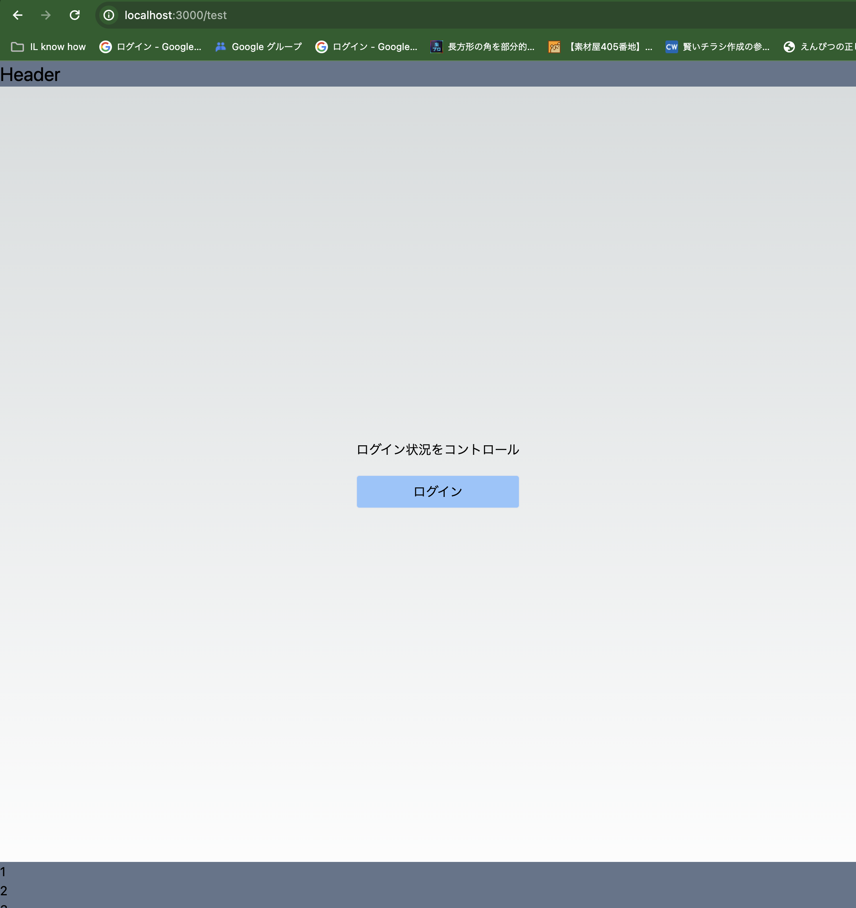
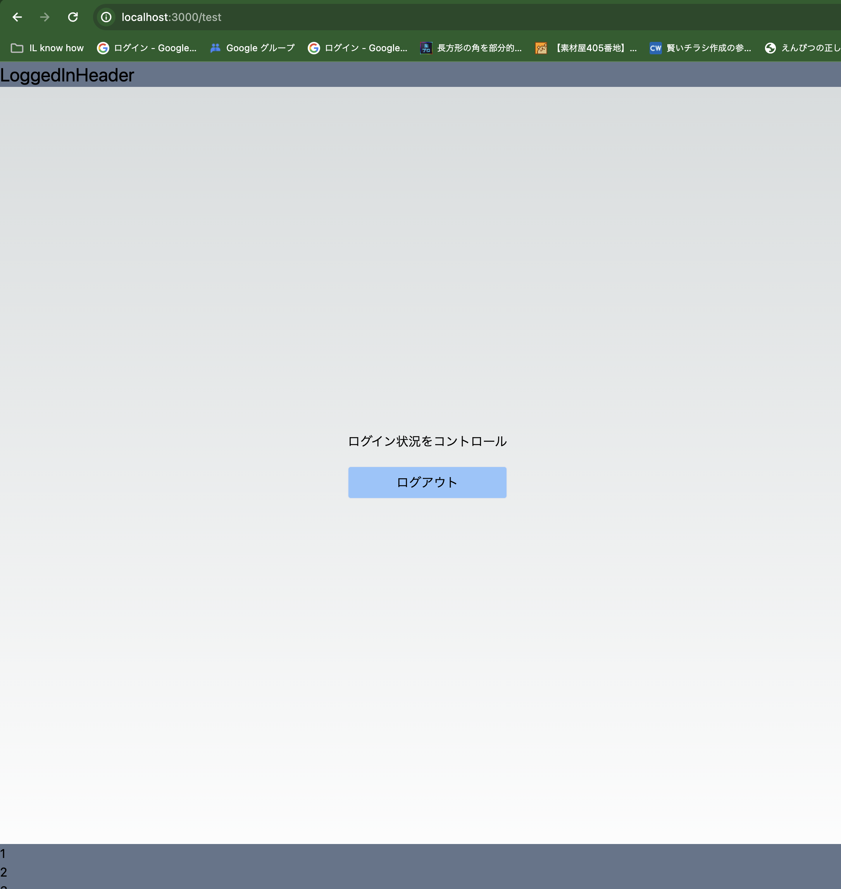
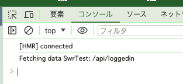

### ログイン状況により Layout を切り替えるサンプル

`npm run dev`

`http://localhost:3000/test`は context provider での実装例

`http://localhost:3000/swr_test`は useSWR の dedupingInterval での実装例

### 構成

- ログイン済みレイアウト `src/components/layouts/LoggedInLayout`
- 未ログインレイアウト `src/components/layouts/NotLoginLayout`
- 上記を束ねる `src/components/layouts/Layout`

現在は暫定的に `src/pages/api/loggedin.api.ts` からログイン状態をランダムで取得し表示する構成にしている。

### 参考

#### 未ログイン

#### ログイン済み

#### useSWR

https://swr.vercel.app/ja/docs/api

useSWR の dedupingInterval オプションは、同じキーに対する連続するリクエストをデデュプリケート（重複排除）する時間をミリ秒単位で指定します。これは、指定した時間内に同じキーで useSWR フックが複数回呼び出された場合、実際のデータ取得は 1 回だけ行われ、その結果がすべての useSWR フックに共有されることを意味します。

重複排除を検知することはできないが、console.log を配置することで、起動時にどれが発火したかを観察することができる。

